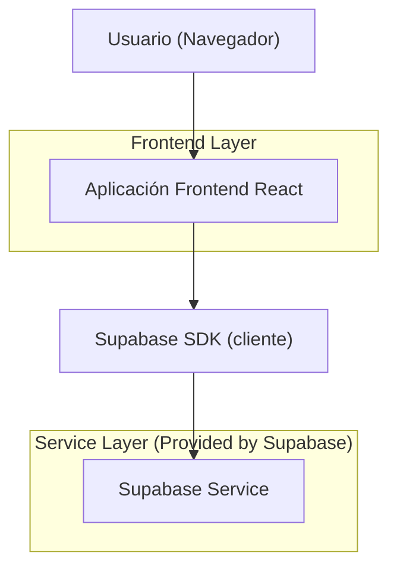
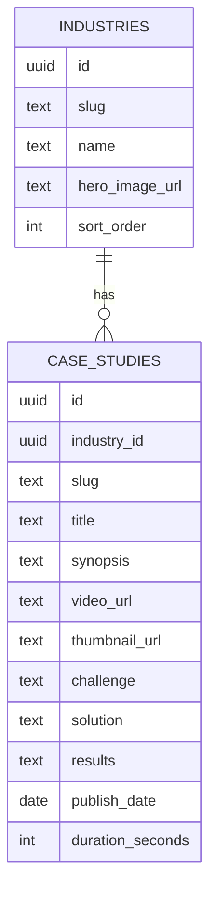

## 1.Architecture design


## 2.Technology Description
- Frontend: React@18 + react-router-dom@6 + tailwindcss@3
- Backend: None
- Data/Media: Supabase (PostgreSQL para metadatos + Storage para videos/imagenes)

## 3.Route definitions
| Route | Purpose |
|-------|---------|
| / | Inicio, navegación principal + mega-menú Industrias |
| /industrias/:industriaSlug | Página de industria (11 slugs permitidos) |
| /casos | Listado de Casos de Éxito (mini-documentales) |
| /casos/:caseSlug | Detalle de Caso de Éxito (reproductor + narrativa) |
| /nosotros | Página corporativa |
| /contacto | Formulario de contacto |

## 6.Data model(if applicable)

### 6.1 Data model definition


### 6.2 Data Definition Language
Industries (industries)
```
CREATE TABLE industries (
  id UUID PRIMARY KEY DEFAULT gen_random_uuid(),
  slug TEXT UNIQUE NOT NULL,
  name TEXT NOT NULL,
  hero_image_url TEXT,
  sort_order INT DEFAULT 0,
  created_at TIMESTAMPTZ DEFAULT NOW()
);

CREATE INDEX idx_industries_sort_order ON industries(sort_order);
```

Case Studies (case_studies)
```
CREATE TABLE case_studies (
  id UUID PRIMARY KEY DEFAULT gen_random_uuid(),
  industry_id UUID NOT NULL,
  slug TEXT UNIQUE NOT NULL,
  title TEXT NOT NULL,
  synopsis TEXT,
  video_url TEXT,
  thumbnail_url TEXT,
  challenge TEXT,
  solution TEXT,
  results TEXT,
  publish_date DATE,
  duration_seconds INT,
  created_at TIMESTAMPTZ DEFAULT NOW()
);

CREATE INDEX idx_case_studies_industry_id ON case_studies(industry_id);
CREATE INDEX idx_case_studies_publish_date ON case_studies(publish_date DESC);
```

Permisos mínimos (lectura pública del contenido)
```
GRANT SELECT ON industries TO anon;
GRANT ALL PRIVILEGES ON industries TO authenticated;

GRANT SELECT ON case_studies TO anon;
GRANT ALL PRIVILEGES ON case_studies TO authenticated;
```

Notas de implementación:
- Las “11 rutas” se controlan por lista de slugs permitidos (config) y/o contenido en `industries` (sort_order 1..11).
- Los videos/imágenes se sirven desde Supabase Storage (URLs públicas o firmadas según necesidad).
