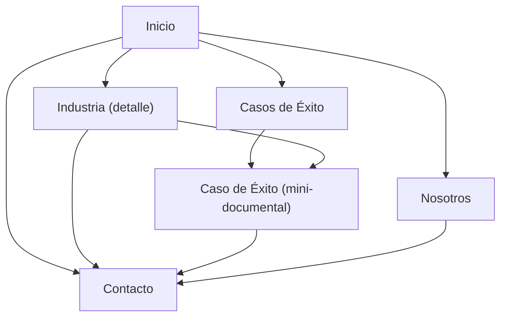

## 1. Product Overview
Sitio corporativo de B&P TECH basado en “Mobhil Home 4”, enfocado en comunicar oferta por industrias (mega-menú con 11 rutas) y demostrar impacto mediante Casos de Éxito en formato mini-documental.
Pensado para visitantes B2B que evalúan proveedores y necesitan evidencias claras, rápidas y creíbles.

## 2. Core Features

### 2.1 User Roles
| Rol | Método de registro | Permisos principales |
|------|---------------------|---------------------|
| Visitante | No aplica | Puede navegar industrias, ver casos de éxito y contactar |

### 2.2 Feature Module
El sitio requiere las siguientes páginas principales:
1. **Inicio**: header con mega-menú (11 industrias), propuesta de valor, accesos a industrias, carrusel/listado de casos, CTAs.
2. **Industria (detalle)**: contenido específico por industria, capacidades/soluciones clave, casos relacionados, CTA a contacto.
3. **Casos de Éxito**: listado de mini-documentales, filtros básicos por industria, acceso a detalle.
4. **Caso de Éxito (mini-documental)**: reproductor de video, narrativa del caso (reto/solución/resultados), assets clave, CTA.
5. **Nosotros**: descripción corporativa de B&P TECH (misión/valores/enfoque), credenciales resumidas.
6. **Contacto**: formulario de contacto y datos corporativos.

### 2.3 Page Details
| Page Name | Module Name | Feature description |
|-----------|-------------|---------------------|
| Inicio | Header + Mega-menú Industrias | Mostrar navegación principal y mega-menú “Industrias” con 11 enlaces (rutas dedicadas) |
| Inicio | Hero / Propuesta de valor | Comunicar mensaje principal y CTA a “Industrias” y “Casos de Éxito” |
| Inicio | Bloque Industrias | Listar 11 industrias con tarjetas y acceso a su ruta |
| Inicio | Bloque Casos de Éxito | Mostrar selección de casos (teasers) con acceso a listado/detalle |
| Industria (detalle) | Contenido por industria | Presentar overview, retos típicos, oferta/capacidades aplicables y CTA |
| Industria (detalle) | Casos relacionados | Listar casos vinculados a esa industria y link a detalle |
| Casos de Éxito | Listado | Mostrar grid/lista de casos con thumbnail, título, industria, duración (si aplica) |
| Casos de Éxito | Filtro por industria | Filtrar casos por una de las 11 industrias (selector simple) |
| Caso de Éxito (detalle) | Reproductor mini-documental | Reproducir video principal y mostrar título/sinopsis básica |
| Caso de Éxito (detalle) | Narrativa del caso | Presentar “Reto / Solución / Resultados” en secciones legibles |
| Caso de Éxito (detalle) | CTA | Llevar a contacto con contexto del caso (ej. “Quiero algo similar”) |
| Nosotros | Perfil corporativo | Explicar quién es B&P TECH y su enfoque, con CTA a contacto |
| Contacto | Formulario | Enviar solicitud con nombre, email, empresa, industria, mensaje |
| Contacto | Información corporativa | Mostrar email/teléfono/dirección (si aplica) y enlaces de navegación |

## 3. Core Process
Flujo de visitante:
1) Entras a Inicio y abres “Industrias” desde el mega-menú.
2) Exploras una industria (de las 11), revisas capacidades y casos relacionados.
3) Abres un Caso de Éxito, miras el mini-documental y validas resultados.
4) Vas a Contacto y envías un mensaje referenciando industria/caso.

